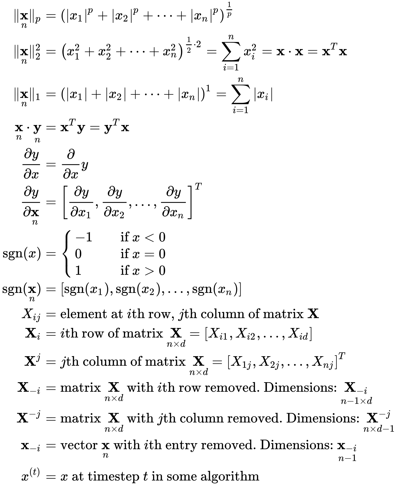
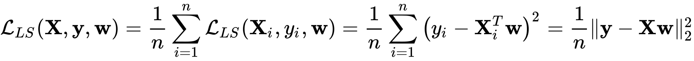
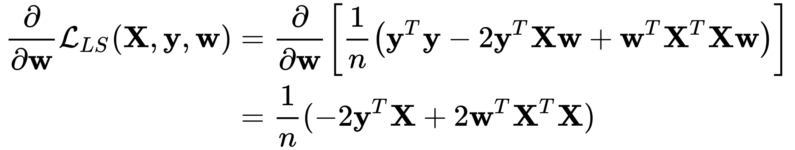
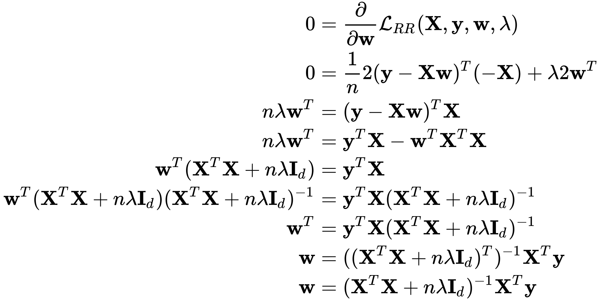
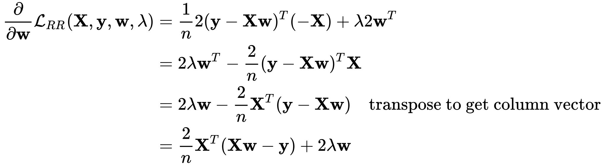
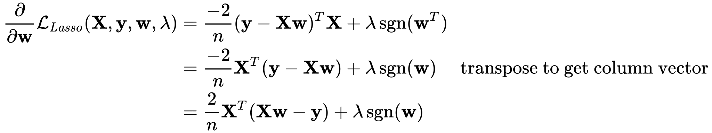

# R&Djam1


## Goal

**Build** linear and logistic regression for MNIST from scratch using pytorch.


## Running

python3. Setup:

```bash
# install python 3.6.2, if needed
pyenv versions  # check if 3.6.2 installed
pyenv install 3.6.2  # only if needed

# pyenv wraps virtualenv to let you pick a python version. global namespace.
pyenv virtualenv 3.6.2 rndj1
pyenv local rndj1  # if .python-version doesn't exist, this places it

# pytroch. (get latest from pytorch.org. this is what i used on ubuntu.)
pip install http://download.pytorch.org/whl/cu80/torch-0.2.0.post3-cp36-cp36m-manylinux1_x86_64.whl
pip install torchvision

# dashboard
pip install visdom
# visdom should already be running. if not, run with: `python -m visdom.server`

# editor setup. for vscode:
pip install mypy
# then in vs code:
# (1) use command `Python: Select Workspace Interpreter` and pick rndj1
# (2) in settings, disable pylint and prospector; enable mypy
#
# once mypy works again with --incremental or --quick-and-dirty:
# (3) to get mypy to find libs (like torch), create a mypy.ini file in this
#     directory with "[mypy]" on one line and then "mypy_path=<...>" on the
#     next, where <...> is the path to the site-packages for the rndj1 venv,
#     e.g., "/home/max/.pyenv/versions/rndj1/lib/python3.6/site-packages"
# (4) to get mypy to run interactively even w/ the huge site-packages dir, add
#     the "--quick-and-dirty" arg to the "python.linting.mypyArgs" setting.

# setup for generating math in README: SVGs from tex using mathjax-node-cli.
# First, install node.js somehow. This depends on the OS. I'm using nvm.
# Then, install the dependencies (mathjax-node-cli) with npm:
npm install

# now generate the svg files (placed in svg/) from the tex files in math/
./scripts/tex_to_svg.sh

# get data. writes to data/original/
./scripts/get_data.sh

# split data. writes to data/processed/resplit/
./scripts/split_data.sh

# normalize data. writes to data/processed/normalized/
python normalization.py

# convert data from csv to tensor (faster). writes to data/processed/tensor/
python dataio.py --convert

# add a bias colum
python dataio.py --bias
```


## Data splits

MNIST ([csv version][mnist-csv]) has a 60k/10k train/test split.

I pulled the last 10k off of train for a val set.

My final splits are then 50k/10k/10k train/val/test.

[mnist-csv]: https://pjreddie.com/projects/mnist-in-csv/


## Viewing an image

Here's an MNIST image:


Here it is expanded 10x:


## Data loading: CSV vs binary ("tensor")

y-axis is seconds taken to load the file; lower is better. Result: binary is
way faster.


## Naive regression to scalar

In this we regress each image to a scalar that is the number represented in
that image. For example, we regress the image  to the number `5`.

> Disclaimer: this is dumb. If you're going to treat was is really a
> classification problem (like MNIST) as regression, you should regress to each
> class independently (i.e., do 10 regression problems at once instead of a
> single regression). Explaining why would take math that I would have to talk
> to people smarter than me to produce. I think the intuition is that you're
> making the learning problem harder by forcing these distinct classes to exist
> as points in a 1D real space, when they really have no relation to each
> other.
>
> However: (a) if you're dumb like me, you might try it, (b) if you're bad at
> math like me, it's simpler to start out with a "normal" regression than 10 of
> them, (c) I'm kind of treating this like a notebook, so might as well
> document the simple &rarr; complex progression of what I tried.
>
> So here we go.

### Notation

Definitions:


Math reminders:



> NB: While the derivative of a function **f** : ℝ<sup>n</sup> &rarr; ℝ is
> [technically a row
> vector](https://en.wikipedia.org/wiki/Jacobian_matrix_and_determinant),
> people&trade; have decided that gradients of functions are column vectors,
> which is why I have transposes sprinkled below. (Thanks to Chris Xie for
> explaining this.)

### Ordinary least squares (OLS)

Dataset **loss**:



Expanding out for my noob math:


Taking the **derivative** of the loss function with respect to the weights:



We can set the gradient equal to 0 (the zero vector) and solve for the
**analytic solution** (omitting second derivative check):


To do gradient descent instead, we'll use the gradient of the average loss per
datum. The average loss per datum is nice because it's invariant to the size of
the dataset (or (mini)batch). The **average loss per datum** is simply:


We can just take scale the gradient that we got previously to get our
**gradient for gradient descent**:


### Ridge regression

From here on out, I'l just always use per-datum averaged loss for the
convenience of having a single loss function (though sometimes this will cause
some constant smushing).

> NB: For all regularization methods (e.g., ridge and lasso), shouldn't be
> regularizing the weight corresponding to the bias term (I added as an extra
> feature column of `1`s). You can remedy this by either (a) centering the `y`s
> and omitting the bias term, or (b) removing the regularization of the bias
> weight in the loss and gradient. I tried doing (b) but I think I failed (GD
> wasn't getting nearly close enough to analytic loss), so I've left the
> normalization in there for now (!).

**Loss:**


**Derivative:**

(Being a bit more liberal with my hand waving of vector and matrix derivatives
than above)


**Analytic:**

> NB: I think some solutions combine _n_ into _λ_ because it looks cleaner. In
> order to get the analytic solution and gradient (descent) to reach the same
> solution, I needed to be consistent with how I applied _n_, so I've left it
> in for completeness.



**Gradient:**

(Just massaging the derivative we found a bit more.)



### Lasso

**Loss:**


**Derivative:**


Focusing on the final term, we'll use the subgradient, and pick `0` (valid in
`[-1, 1]`) for the nondifferentiable point. This means we can use `sgn(x)` as
the "derivative" of `|x|`.


Substitute in to get the final term for the (sub)gradient:



> NB: There's no soft thresholding (sparsity-encouraging) property of LASSO
> when you use gradient descent. You need something like coordinate descent to
> get that.

## Links

- [Table of regularized least squares functions (Wikipedia)](https://en.wikipedia.org/wiki/Regularized_least_squares#Partial_list_of_RLS_methods)
- [The Matrix Cookbook (Petersen & Pedersen)](https://www.math.uwaterloo.ca/~hwolkowi/matrixcookbook.pdf)
- [OLS with matrices notes (possibly Rosenfeld?)](https://web.stanford.edu/~mrosenfe/soc_meth_proj3/matrix_OLS_NYU_notes.pdf)
- [Coordinate Descent (Gordon & Tibshirani)](https://www.cs.cmu.edu/~ggordon/10725-F12/slides/25-coord-desc.pdf)

## Acknowledgements

Many thanks to Chris Xie and John Thickstun for helping me out with math.
