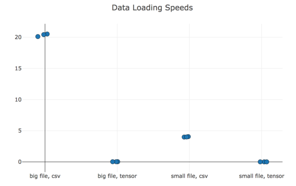

# R&Djam1


## Goal

**Build** linear and logistic regression for MNIST from scratch using pytorch.


## Running

python3. Setup:

```bash
# install python 3.6.2, if needed
pyenv versions  # check if 3.6.2 installed
pyenv install 3.6.2  # only if needed

# pyenv wraps virtualenv to let you pick a python version. global namespace.
pyenv virtualenv 3.6.2 rndj1
pyenv local rndj1  # if .python-version doesn't exist, this places it

# pytroch. (get latest from pytorch.org. this is what i used.)
pip install http://download.pytorch.org/whl/cu80/torch-0.2.0.post3-cp36-cp36m-manylinux1_x86_64.whl
pip install torchvision

# dashboard
pip install visdom
# visdom should already be running. if not, run with: `python -m visdom.server`

# editor setup. for vscode:
pip install mypy
# then in vs code:
# (1) use command `Python: Select Workspace Interpreter` and pick rndj1
# (2) in settings, disable pylint and prospector; enable mypy

# get data. writes to data/original/
./scripts/get_data.sh

# split data. writes to data/processed/resplit/
./scripts/split_data.sh

# normalize data. writes to data/processed/normalized/
python normalization.py

# convert data from csv to tensor (faster). writes to data/processed/tensor/
python dataio.py --convert

# add a bias colum
python dataio.py --bias
```


## Data splits

MNIST ([csv version][mnist-csv]) has a 60k/10k train/test split.

I pulled the last 10k off of train for a val set.

My final splits are then 50k/10k/10k train/val/test.

[mnist-csv]: https://pjreddie.com/projects/mnist-in-csv/


## Viewing an image

Here's an MNIST image:


Here it is expanded 10x:


## Data loading: CSV vs binary ("tensor")

y-axis is seconds taken to load the file; lower is better. Result: binary is
way faster.


